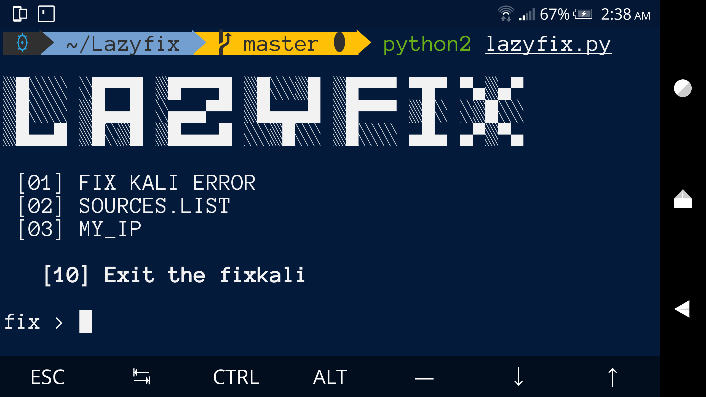

# Lazyfix
Lazyfix tools installer is very
easy to use, only provided for lazy termux users.

## Screenshot


### Requirements
• Python 2.x

#### Installation and Using Lazyfix
```
git clone 
https://github.com/wooooolf/Lazyfix
```
```
cd Lazyfix
```
```
chmod 777 * 
```
python2 lazyfix.py
```

## Contact Me
Facebook : abdellah.moutassadeq.7


